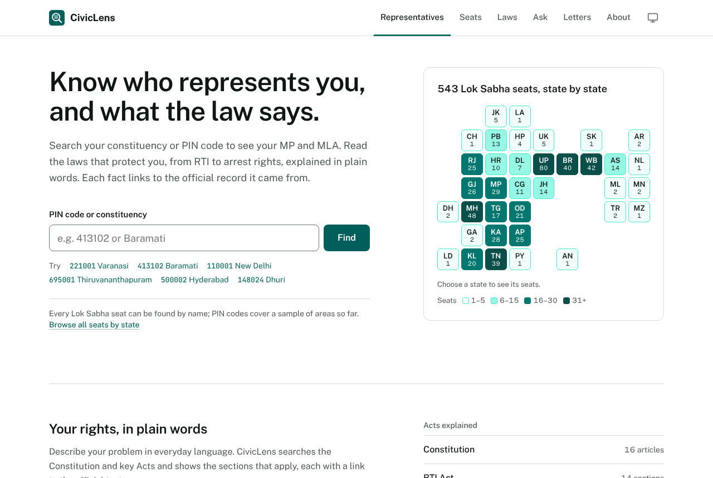
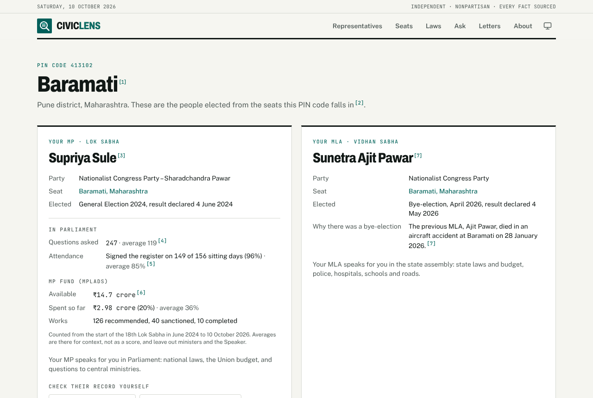
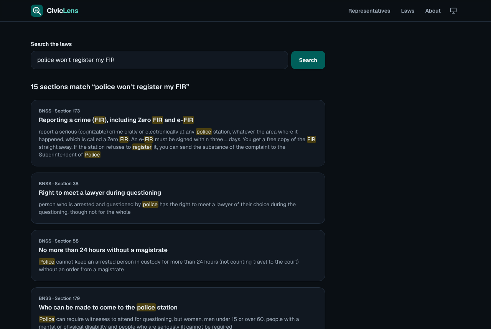
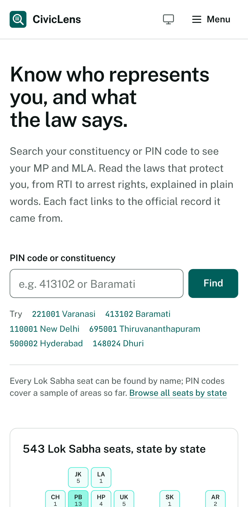
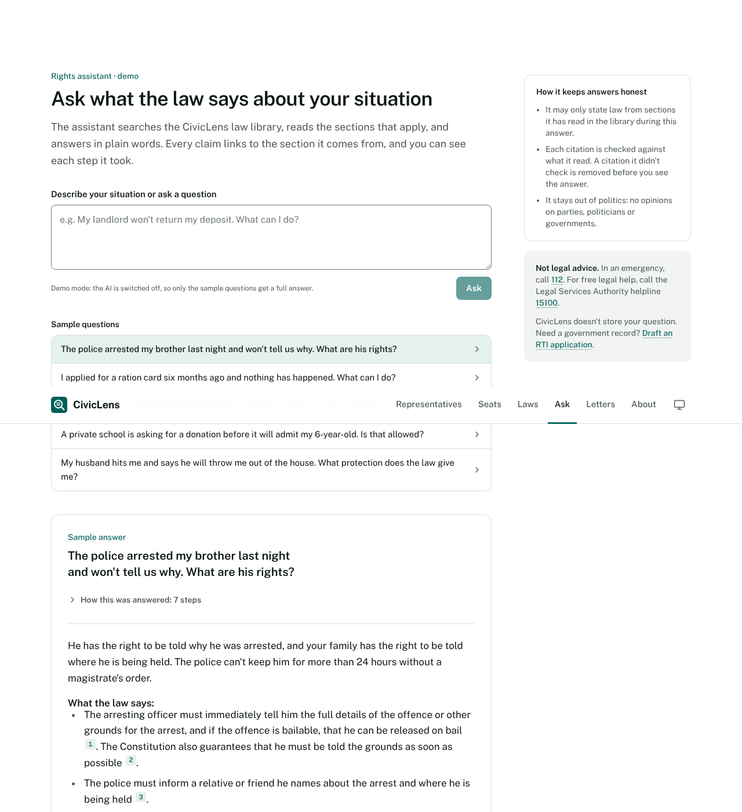
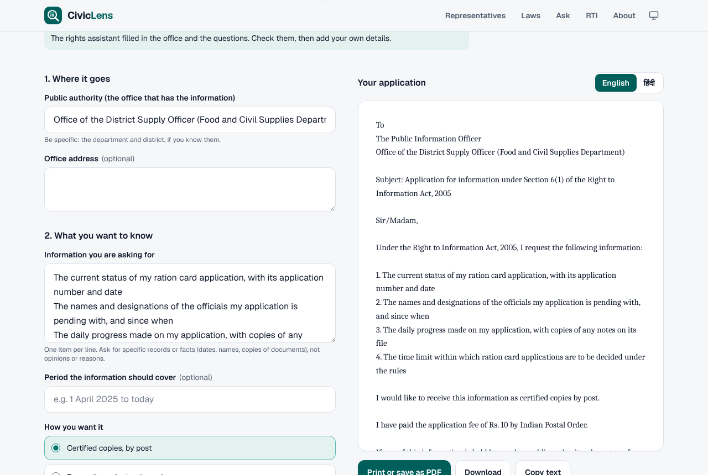

# CivicLens

**Know who represents you, and what the law says.** Enter a PIN code to see your MP and MLA, and
search the laws that protect you (from RTI to arrest rights) by describing your problem in everyday
words. Strictly nonpartisan: every fact links to the official record it came from.

**Live:** https://civiclens-ruby.vercel.app (the API sleeps when idle, so the first page can take up to a minute)

[](https://github.com/whatalshifa/civiclens/actions/workflows/ci.yml)
[](LICENSE)



## What it does

- **Find your representatives.** A PIN code leads to the Lok Sabha and Vidhan Sabha seats it falls
  in and the people who hold them. Every fact carries a numbered source, like a footnote, and a date.
- **Every Lok Sabha seat, kept current.** All 543 seats and their sitting MPs, from the Lok Sabha's
  own list. A weekly data pipeline checks it and opens a pull request when something changes, so a
  person reviews every update before it goes live.
- **Search the law in plain words.** "Police won't register my FIR" finds BNSS section 173 (Zero FIR).
  Postgres full-text search ranks 71 sections of the Constitution and five Acts, and highlights why
  each one matched.
- **Ask the rights assistant.** Describe your situation and an AI agent searches the law, reads the
  sections that apply and answers in plain words, showing each step as it happens. Every citation is
  checked against the sections it actually read before you see it.
- **Draft an RTI application.** A short form writes a ready-to-send application under the RTI Act,
  in English or Hindi, entirely in your browser.
- **Read laws simply.** Each section has a plain-language summary, clearly labelled as a summary, with
  a link to the official text. The library covers the new criminal laws (BNS, BNSS, BSA), and an
  old-to-new lookup turns "IPC 420" into "BNS 318(4)" from the official correspondence tables.
- **Nonpartisan by design.** Same fields for everyone, ordered by place, never by party. No ratings,
  photos or party colours. The rules are enforced in the data checks and tests.
- **Works for everyone.** Server-rendered pages that work without JavaScript, on phones, in dark mode,
  and pass automated WCAG AA accessibility checks.

| Your representatives | Search the law | On a phone |
|---|---|---|
|  |  |  |

| The rights assistant, step by step | Draft an RTI application |
|---|---|
|  |  |

## Built with

Next.js 16 (server components) · FastAPI · Claude API with tool use (an agent loop) · Server-Sent
Events · PostgreSQL full-text search · SQLAlchemy and Alembic ·
Shapely (spatial joins) · Playwright and axe for browser tests · GitHub Actions.

## How it fits together

```
browser ──> Next.js website ──(server-side fetch + secret header)──> FastAPI ──> Postgres
                                                                       ▲
                                         app/data/*.yaml ──checked and loaded on start
                                                ▲
              official records ──weekly pipeline──> pull request ──> app/data/generated/*.csv
```

The data lives in reviewable YAML files. On start the API checks them (every fact must name a
source, every PIN must be valid) and loads them in one transaction. Read
[docs/ARCHITECTURE.md](docs/ARCHITECTURE.md) for a walk through the code and
[docs/DATA.md](docs/DATA.md) for the data and neutrality rules.

## Run it yourself

```bash
docker compose up --build      # then open http://localhost:3000
```

Or without Docker: start Postgres, then `cd backend && pip install -r requirements-dev.txt && alembic
upgrade head && uvicorn app.main:app` and `cd frontend && npm install && npm run dev`.

Tests: `cd backend && pytest` (needs Postgres; see `tests/conftest.py`) and
`cd frontend && npx playwright test`.

## Status

- Phase 1: representatives for a hand-checked sample of 25 PIN codes in 12 states, and the law library.
- Phase 2: the rights assistant and the RTI drafter. The live site runs the assistant in demo mode
  (five sample questions) until an API key is added.
- Phase 3: a data pipeline. All 543 Lok Sabha seats and MPs from the Lok Sabha's list, refreshed
  weekly by GitHub Actions through reviewed pull requests, and a PIN-code-to-seat mapper that places
  India Post's offices on constituency maps.
- Deployed on Vercel (website), Render (API) and Neon (Postgres), all on free tiers.
- Next: every PIN code, and state assembly seats.

CivicLens is an independent project, not a government website, and doesn't give legal advice.
